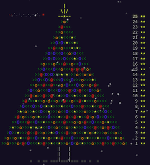

# Advent of Code

[Advent of Code Site](https://adventofcode.com/)

I typically cannot solve these in real time because by the end of the first
week my wife transitions from faces to foot tapping to stern words to making
me fear for my life. :kissing_heart:

## Notes

| Year | Stars | Notes |
| :--- | :--- | :--- |
| 2024 | 33 | Go |
| 2023 | 47 | Go |
| 2022 | 25 | Go, Rust and Python |
| 2021 | 23 | Go and Python |
| 2020 | 19 | Python - first year to join |
| 2019 |  2 | C - wrote solution in 2020 |
| 2018 |  0 | Did not participate |
| 2017 |  0 | Did not participate |
| 2016 | 23 | Go |
| 2015 | 50 | Go, Rust and Python |

## Completing All Years

I plan to complete all years' puzzles with Go (maybe revisit with Rust).

### 2015 Done

END OF LINE
