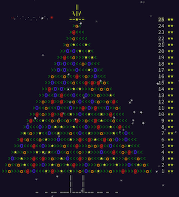
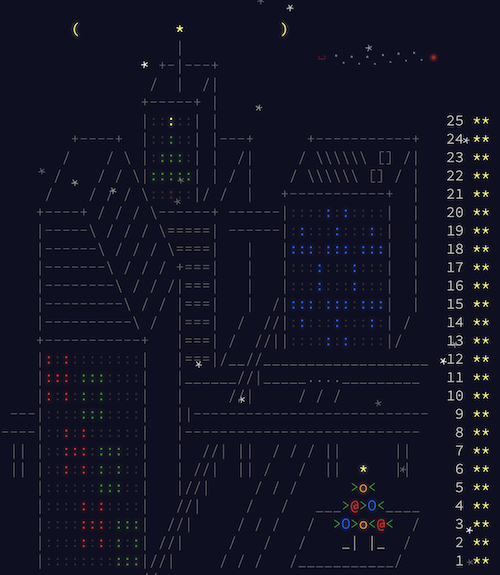

# Advent of Code

[Advent of Code Site](https://adventofcode.com/)

I **love** Advent of Code, but I have never gotten an opportunity to code the
solutions in real time (daily). While I write code for work, and much of that
ends up performance-optimized, I rarely think about computer science
algorithms. Instead, much of my programming ends up working with libraries
and interfacing with APIs. The Advent of Code puzzles provide an opportunity
to go back in time, to think about lower-level approaches to problems. Some
work friends and I have private leaderboards or vow to work with a specific
language to solve puzzles, but I cannot compete with speedcoders. I mean,
I have seen times posted on the global leaderboard before I have fully
grokked the problem to solve.

In 2025, I decided to earn all the stars, completing puzzles in order,
starting with the first ones from 2015. And, I decided to solve them all
using the Go programming language. These live in the `/go` directory, which
contains a `Makefile` for build, execution and testing.

## Build and Execution

```
> make build && ./aoc --help
Advent of Code puzzles solved with Go. Use `make` to see build and execution options.

Usage:
  make YEAR=2015 DAY=1 run [flags]

Flags:
  -d, --day int    Day of the puzzle
  -h, --help       help for make
  -y, --year int   Year of the puzzle
```

Parsing the command line arguments comes from the Cobra package (see `/cmd`
for more information).

You do not need to build the executable in order to solve a specific day.
Instead, use `make run`.

```
> make YEAR=2016 DAY=7 run
Year=2016 Day=07 Part 1: 105 (13.804417ms)
Year=2016 Day=07 Part 2: 258 (10.719625ms)
```

To run all days for one year, use `DAY=0`.

```
> make run YEAR=2016 DAY=0
Year=2016 Day=01 Part 1: 243 (489.625µs)
Year=2016 Day=01 Part 2: 142 (360.583µs)
Year=2016 Day=02 Part 1: 38961 (162.667µs)
Year=2016 Day=02 Part 2: 46C92 (127.041µs)
Year=2016 Day=03 Part 1: 982 (522µs)
Year=2016 Day=03 Part 2: 1826 (487.625µs)
Year=2016 Day=04 Part 1: 245102 (4.704791ms)
Year=2016 Day=04 Part 2: 324 (2.766459ms)
Year=2016 Day=05 Part 1: 1a3099aa (5.68779175s)
Year=2016 Day=05 Part 2: 694190cd (8.923914542s)
Year=2016 Day=06 Part 1: mlncjgdg (841.916µs)
Year=2016 Day=06 Part 2: bipjaytb (352.792µs)
Year=2016 Day=07 Part 1: 105 (6.849209ms)
Year=2016 Day=07 Part 2: 258 (7.119709ms)
Year=2016 Day=08 Part 1: 121 (218.375µs)
Year=2016 Day=08 Part 2:
###..#..#.###..#..#..##..####..##..####..###.#....
#..#.#..#.#..#.#..#.#..#.#....#..#.#......#..#....
#..#.#..#.#..#.#..#.#....###..#..#.###....#..#....
###..#..#.###..#..#.#....#....#..#.#......#..#....
#.#..#..#.#.#..#..#.#..#.#....#..#.#......#..#....
#..#..##..#..#..##...##..####..##..####..###.####.

 (176.041µs)
Year=2016 Day=09 Part 1: 98135 (38.875µs)
Year=2016 Day=09 Part 2: 10964557606 (609.792µs)
[TRUNCATED]
```

## Tests

Using `make test` will provide test and coverage output. All functions adhere
to a naming standard to easily display test coverage for a specific day.

```
> make test | grep y16d07.go | column -t
github.com/bandarji/aoc/adventofcode/y16d07.go:16:  y16d07              100.0%
github.com/bandarji/aoc/adventofcode/y16d07.go:35:  y16d07ParseAddress  100.0%
github.com/bandarji/aoc/adventofcode/y16d07.go:54:  y16d07IsTLS         100.0%
github.com/bandarji/aoc/adventofcode/y16d07.go:64:  y16d07HasABBA       100.0%
github.com/bandarji/aoc/adventofcode/y16d07.go:75:  y16d07IsSSL         100.0%
github.com/bandarji/aoc/adventofcode/y16d07.go:87:  y16d07FindABAs      100.0%
```

# Progress

| Year | Stars |
| :--- | :--- |
| 2025 | (00) ⛤ |
| 2024 | (33) 🌟🌟🌟🌟🌟 🌟 |
| 2023 | (47) 🌟🌟🌟🌟🌟 🌟🌟🌟🌟 |
| 2022 | (35) 🌟🌟🌟🌟🌟 🌟🌟 |
| 2021 | (23) 🌟🌟🌟🌟 |
| 2020 | (19) 🌟🌟🌟 |
| 2019 | (02) ⛤ |
| 2018 | (00) ⛤ |
| 2017 | (18) 🌟🌟🌟 |
| 2016 | (50) 🌟🌟🌟🌟🌟 🌟🌟🌟🌟🤩 |
| 2015 | (50) 🌟🌟🌟🌟🌟 🌟🌟🌟🌟🤩 |

## 2015 Complete!



## 2016 Complete!


